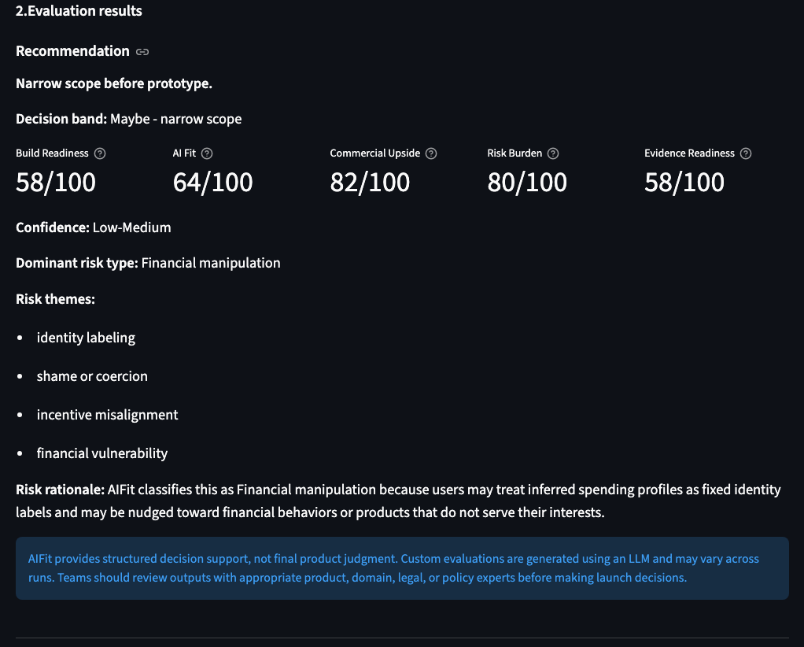
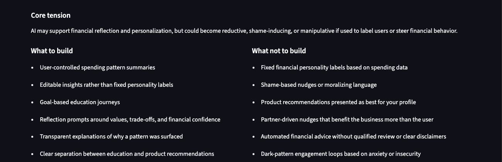
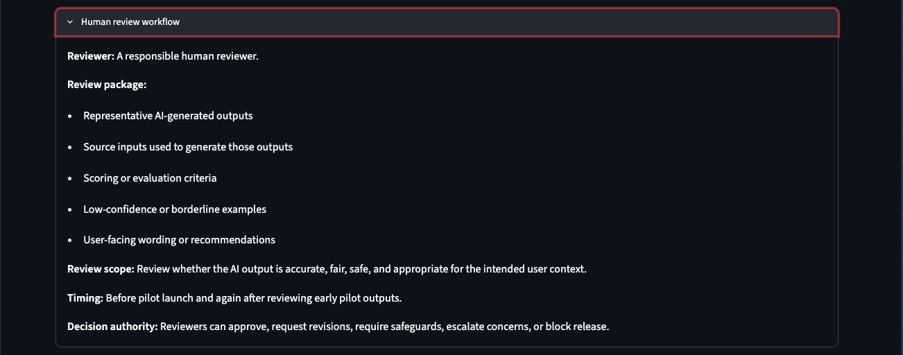
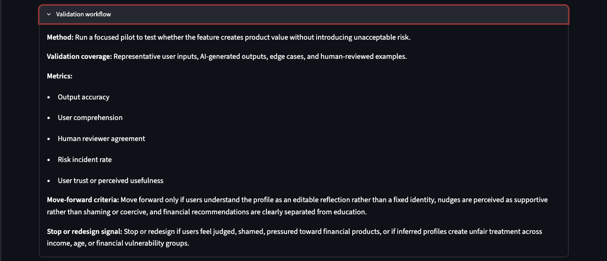

# AIFit

AIFit is a human-in-the-loop AI product decision tool for evaluating whether an AI feature should be built, narrowed, prototyped, or avoided.

It helps product teams assess **AI Fit**, **Commercial Upside**, **Risk Burden**, and **Evidence Readiness**, then generates a structured human review and validation workflow.

## Why I built this

Many AI product discussions focus on capability and feasibility: *Can we build this with AI?*

AIFit asks a different product question:

> What version of this AI feature creates product value without creating unacceptable risk?

I built AIFit to practise AI product decision-making, human-AI workflow design, and responsible AI scoping through a working MVP.

## What it does

AIFit helps product teams pressure-test AI feature ideas before build.

It helps users:

- compare AI vs non-AI alternatives;
- identify the useful kernel of an AI feature;
- identify risky product framing;
- assess AI fit, commercial upside, risk burden, and evidence readiness;
- generate a structured human review workflow;
- generate a structured validation workflow;
- export the result as Markdown for documentation.

The app is not a final decision-maker. It is a **decision-support tool for AI product managers**.

## System architecture


*AIFit transforms an AI feature idea into a risk-aware decision-support report through structured evaluation, risk-specific guidance, and human review planning.*



**Evaluation summary:** AIFit generates a recommendation, Build Readiness score, risk classification, and rationale.



**Build boundaries:** The app separates useful product scope from risky implementation patterns.



**Human review workflow:** AIFit specifies who should review the AI output, what artifacts to inspect, and what authority reviewers have.



**Validation workflow:** AIFit helps teams define how the feature should be tested, what scenarios to include, what metrics to track, and when to move forward or redesign.

## Evaluation framework

AIFit evaluates AI feature ideas across four dimensions: AI Fit, Commercial Upside, Risk Burden; and Evidence Readiness.

### AI Fit

Does AI add meaningful value beyond a simpler non-AI solution?

### Commercial Upside

Could the feature create adoption, retention, revenue, differentiation, or efficiency?

### Risk Burden

What user, product, governance, or failure risk does the feature introduce?

### Evidence Readiness

Can the team test the feature responsibly before launch?

These dimensions are combined into a Build Readiness score, which helps classify whether the feature should be advanced, prototyped, narrowed, reworked, or avoided.

## Human review workflow

AIFit generates a human review workflow that specifies:

- who should review the AI output;
- what artifacts they should inspect;
- what risks, subgroups, or edge cases they should check;
- when review should happen;
- what decision authority the reviewer has.

This is designed to make human oversight more operational and less symbolic.

## Validation workflow

AIFit also generates a validation workflow that specifies:

- the validation method;
- validation coverage;
- risk-specific metrics;
- move-forward criteria;
- stop or redesign signals.

The goal is to help teams define what evidence they need before scaling an AI feature.

## Tech stack

- Language: Python
- App framework: Streamlit
- LLM API: OpenRouter
- Model used for MVP: `nvidia/nemotron-3-nano-omni-30b-a3b-reasoning:free`
- Version control: GitHub
- IDE: VS Code
- Hosting: TBD

## Prerequisites

Before running AIFit locally, make sure you have:

- Python 3.10 or later
- Git
- A virtual environment created for the project
- Required Python libraries installed from `requirements.txt`
- An OpenRouter API key stored in Streamlit secrets

## Local setup

```bash
# Clone the repo
git clone <your-repo-url>
cd ai-fit

# Create virtual environment
python -m venv .venv

# Activate virtual environment
source .venv/bin/activate   # macOS/Linux
# .venv\Scripts\activate    # Windows

# Install dependencies
pip install -r requirements.txt

# Run the app
streamlit run app.py
```

## Streamlit secrets
Create a local Streamlit secrets file:

```bash
mkdir -p .streamlit
touch .streamlit/secrets.toml
```

Add your OpenRouter API key:

```toml

OPENROUTER_API_KEY = "your_api_key_here"

```

Do not commit `.streamlit/secrets.toml` to GitHub.

## Limitations
AIFit is an MVP and should be treated as a structured decision-support tool, not a source of final product judgment.

Current limitations:

* LLM outputs may vary across runs.
* The model may misclassify the dominant risk type.
* Scores are heuristic and should not be interpreted as objective truth.
* The app does not currently verify outputs against external evidence.
* Human review and validation workflows are generated recommendations, not compliance guarantees.
* The MVP uses a free OpenRouter model, so output quality may vary.

## Learning goals
I built AIFit to get hands-on experience in:

* AI product decision-making;
* human-AI interaction design;
* AI vs non-AI product judgment;
* responsible AI scoping;
* structured output design;
* prompt engineering for product workflows;
* explainable scoring;
* risk-aware validation design;
* Streamlit app development;
* OpenRouter API integration;
* agentic / vibe coding for MVP development.

## Future work / backlog
Potential future improvements:
- Add flexible `risk_themes` in addition to the dominant `risk_type`.
  - `risk_type` would remain a broad category for routing.
  - `risk_themes` would capture case-specific nuances such as high-stakes decision support, delayed care, false reassurance, escalation failure, identity labeling, data leakage, or evidence misuse.
- Move `RISK_TYPE_GUIDANCE` out of `app.py` into a separate configuration file.
  - This would make the risk taxonomy easier to maintain without cluttering the main app logic.
- Test whether recurring `risk_themes` should become formal risk types.
  - For example: Health Decision Support, High-Stakes Decision Support, or Workflow Misalignment.
  
